# 🌍 Travel Website with React

This is a **responsive travel website** built with **React.js**. It includes all the essential sections for a simple modern site:

- ✅ Navbar  
- ✅ Hero Section  
- ✅ About Section  
- ✅ Services  
- ✅ Tour Section  
- ✅ Footer  

Built for **mobile-first** and fully responsive on all screen sizes.

---

## 📸 Screenshots

### 🖥️ Desktop View

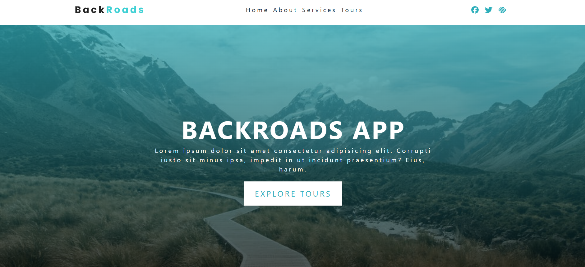
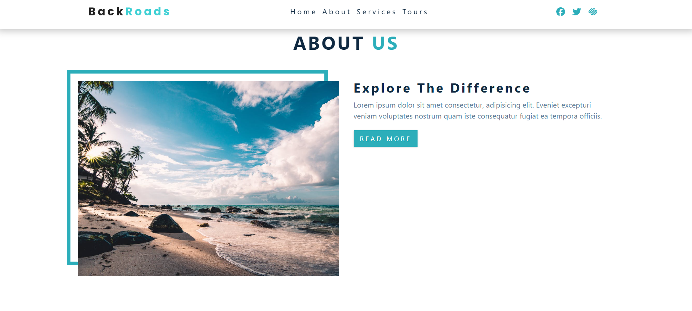
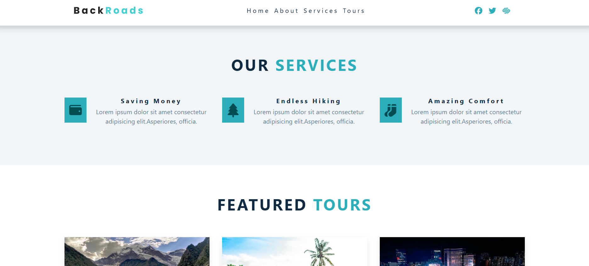
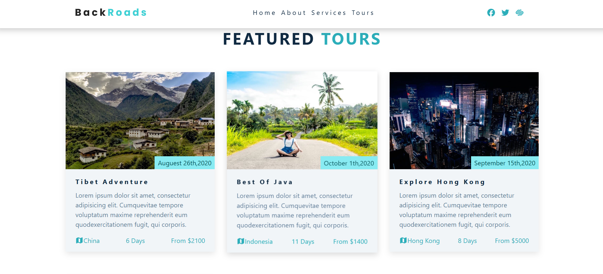
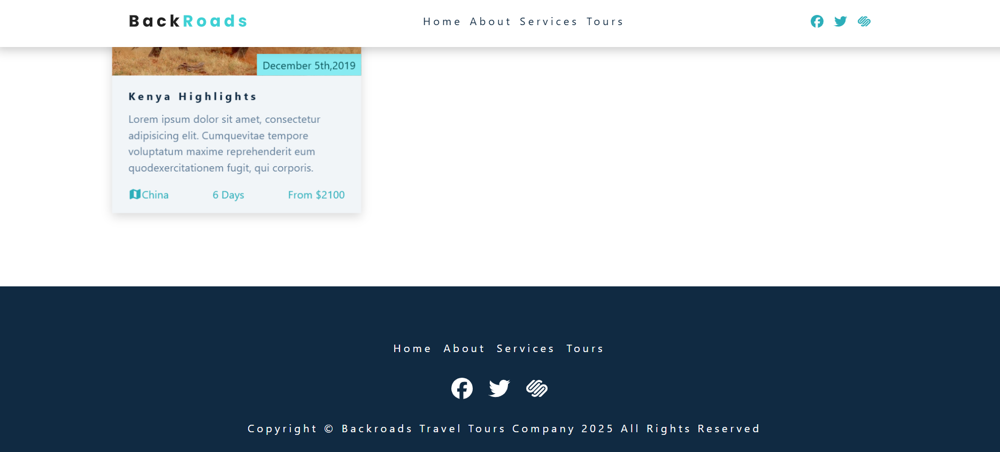


### 📱 Mobile View

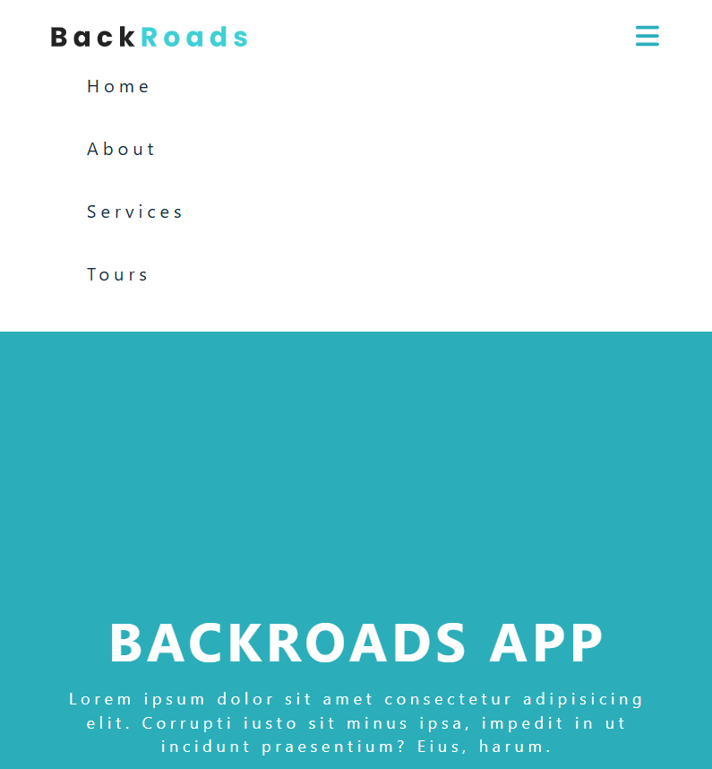
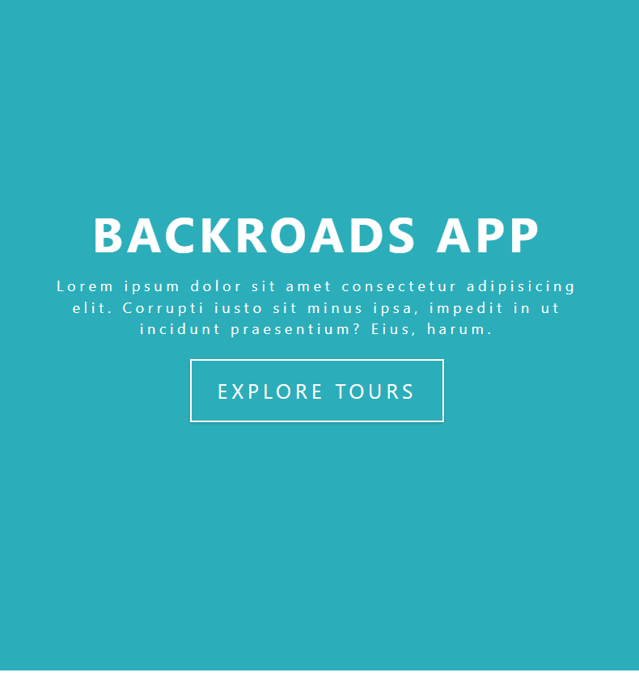
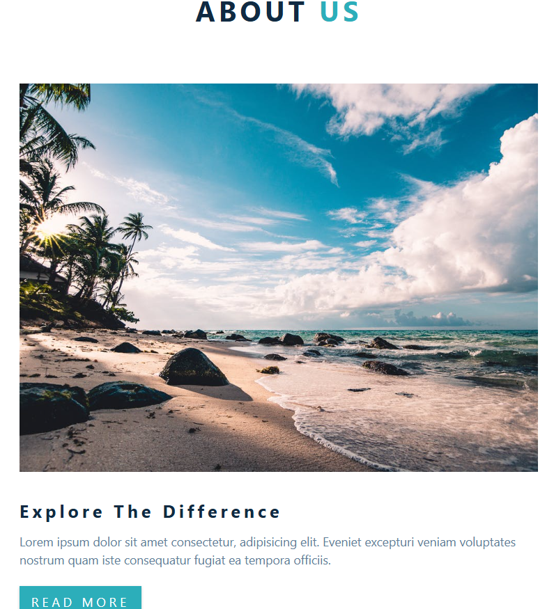
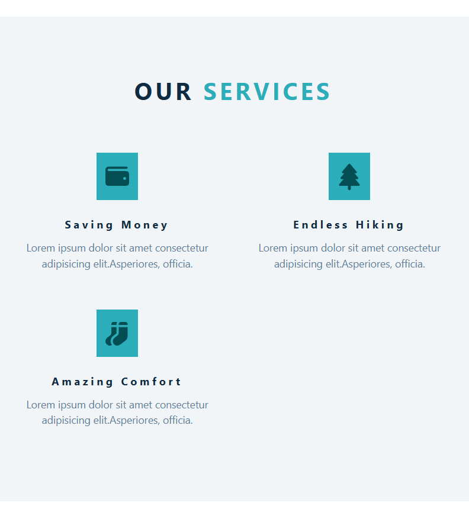
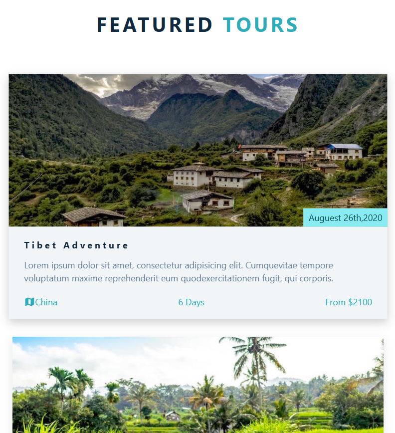
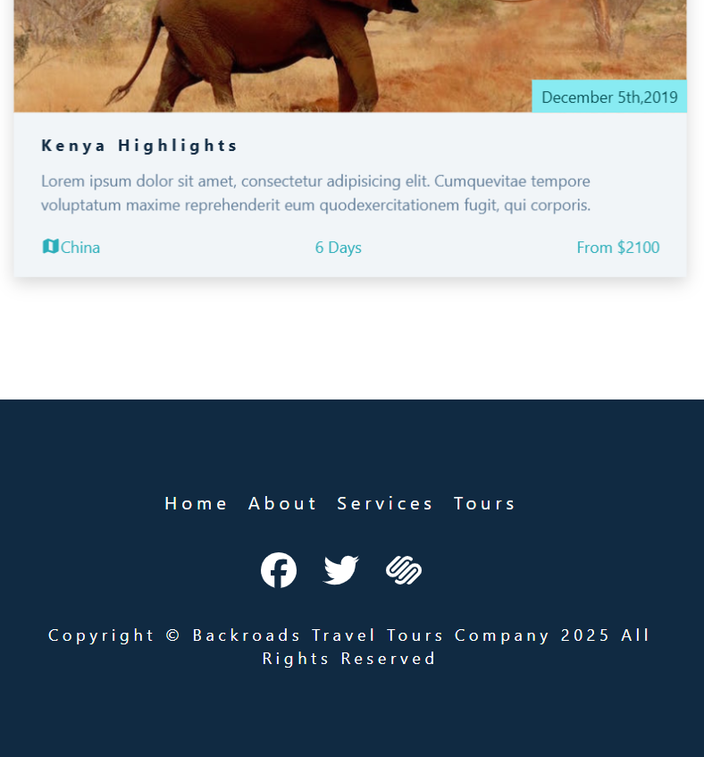


---

## 🛠️ Built With

- [React.js](https://reactjs.org/)
- CSS3 (Custom styles and media queries)
- Font Awesome (Icons)

---


---

## 🚀 Getting Started

Clone the repository and run the project locally:

```bash
git clone https://github.com/your-username/your-repo-name.git
cd your-repo-name
npm install
npm start


## 🙏 Credits 📝 License

This project is for educational purposes.  
Original design and structure by [john-smilga](https://github.com/john-smilga).  
Cloned under [MIT License] or as per the original license.
